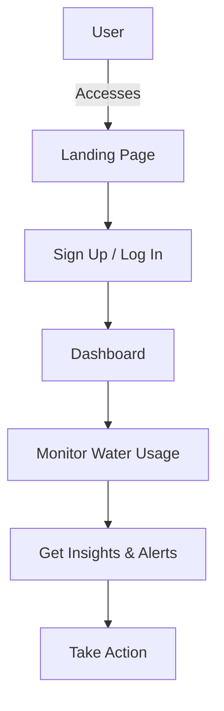

# AquaMinder 💧


---

## 🚀 What is AquaMinder?
AquaMinder is your modern, intuitive, and animated water monitoring solution. Track, analyze, and optimize your water usage with a beautiful, interactive dashboard. Stay hydrated, save resources, and make smarter decisions for a sustainable future!

---

## ✨ Features
- **Real-Time Monitoring** 📊
- **Interactive Dashboard** 🖥️
- **Custom Alerts & Notifications** 🔔
- **Insightful Analytics** 📈
- **Mobile Friendly** 📱
- **Easy Integration** 🔗

---

## 🛠️ Tech Stack
- **Next.js** ⚡
- **TypeScript** 🟦
- **Tailwind CSS** 🎨
- **Markdown Content** 📝

---

## 🔄 How It Works



---

## 🚦 Quick Start

```bash
# 1. Clone the repo
git clone https://github.com/mohdrazakhan/AquaMinder.git

# 2. Install dependencies
cd AquaMinder/Website_AquaMinder/aquaminder
npm install

# 3. Start the development server
npm run dev
```

---

## 🌟 Screenshots & Animation


---

## 🤝 Contributing
We welcome contributions! Please read our [CONTRIBUTING.md](CONTRIBUTING.md) for guidelines. Open issues, suggest features, or submit PRs to make AquaMinder even better!

---

## 📄 License
MIT License © 2025 [AquaMinder](https://github.com/mohdrazakhan/AquaMinder)

---

> _Stay hydrated, stay smart!_ 💦
